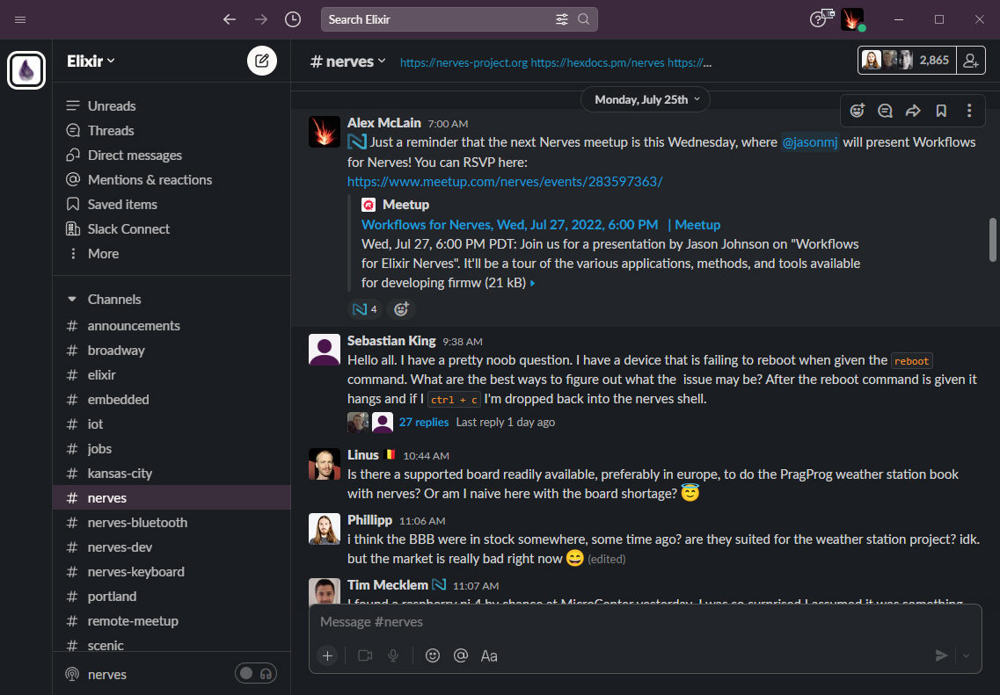
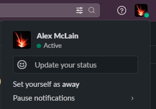
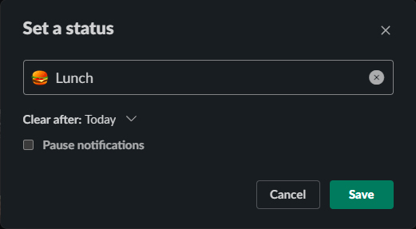
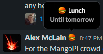

# Slack

[Slack](https://slack.com/) is a popular communication tool for remote and semi-remote teams.

## Traits

**Slack is**
- Ephemeral
- A place to have conversations
- A mechanism for status updates and notifications
- A way to receive automated notices (i.e. deployment status, production errors)
- A way to communicate with parties outside of your organization

**Slack is not**
- Persistent
- A knowledge base or archive
- Documentation
- Email

## Status

Slack has a way to let other folks know what you are up to. This is particularly
helpful for communicating when you are busy or away during your typical office
hours so that others know to expect a more delayed response. It's also a signal
that the sender has more time to draft a single message with good quality
information, rather than spreading thoughts quickly across a chain of messages.
This can help reduce the receiver's notification fatigue.

Status messages can be used for events like meetings, lunch, errands, personal
appointments, vacation, on-site visits, and so on. Choose an emoji that
resembles the activity so the message is clear.

When setting a status, err on the pessimistic side when setting the time it
automatically clears. It's important to communicate when you are unavailable,
and it's easy to manually clear your status message when you're available.
The setting to automatically clear your status is a backup for when you forget
to clear it.

When using asynchronous communication patterns correctly, a busy or away status
means the sender should expect a delayed response, *not* that messages shouldn't
be sent.

## Direct Messages (DMs)

In most cases, AVOID direct messages. It may seem convenient or unobtrusive to
the broader team to have project discussions in direct messages. However, what
this actually does is reduces visibility and shared knowledge about what was
discussed, and decisions that may have been made. If a conversation would be
appropriate to have with every member of the team, it should most likely be in a
public channel. Steering information to public channels helps keep the team on
the same page, and gives people a chance to chime in on topics they may have
knowledge on.

Times when it is appropriate to use direct messages are for things like
sensitive or personal information. For example, a manager shouldn't give
feedback to a lead engineer on how to run the team better in the team's public
channel. This kind of coaching is better in a DM or a one-on-one.
